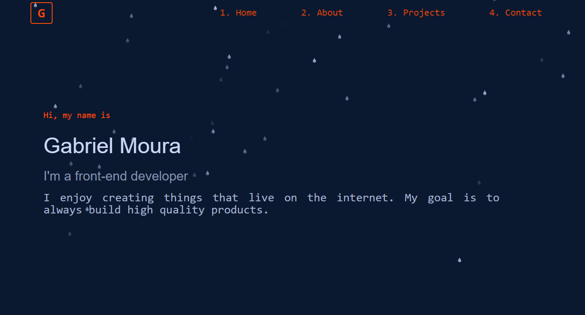

# My Portfolio
This is my first version of my personal portfolio. 

## Table of Contents
- [My Portfolio](#my-portfolio)
  - [Table of Contents](#table-of-contents)
  - [Getting Started](#getting-started)
  - [Contributing](#contributing)
  - [License](#license)

## Getting Started
I hope you enjoy!

[Portfolio]()

## Contributing
If you would like to contribute, please fork the repository and use a feature branch. Pull requests are warmly welcome.

## License
This project is licensed under the MIT License - see the [LICENSE.md](LICENSE.md) file for details.

---
Made by Gabriel Moura. [Get in touch!](https://www.linkedin.com/in/gabriel-moura-b45b90150/)